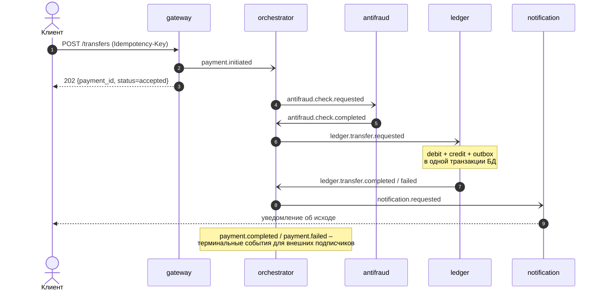

# FinTrack v2 – P2P-переводы на событийной архитектуре

Пет-проект для портфолио **системного аналитика**: перевод денег между счетами,
собранный «по-взрослому» – распределённая сага поверх Apache Kafka, двойная
запись, идемпотентность на каждой границе. Главный артефакт – папка
[`docs/`](docs/) с полным аналитическим пакетом (требования, спецификации по
шаблонам, контракты API, C4, sequence, модель данных, ADR); код в
[`services/`](services/) подтверждает, что описанная архитектура действительно
работает.

> **Происхождение и формат.** Выпускной пет-проект с интенсива Т-Банка,
> доделанный, чтобы потестить Kafka на живом сценарии. Проект подразумевает
> только **локальное развёртывание** (docker compose + make, см.
> [«Быстрый старт»](#быстрый-старт)) – хостинга и публичного стенда нет.

## Как проходит перевод

Клиент видит один синхронный вызов; всё остальное – асинхронная сага
с оркестрацией. Все межсервисные стрелки – события в Kafka
(ключ партиционирования – `from_account`):



Итог (`COMPLETED`/`FAILED` + причина) доступен через `GET /transfers/{payment_id}`,
балансы – через `GET /accounts`. Подробные сценарии, включая отказы и дубликат, –
в [docs/sequence/](docs/sequence/).

## Сервисы

| Сервис | Зона ответственности | Запуск |
|--------|----------------------|--------|
| `gateway` | Синхронный REST-вход (FastAPI); идемпотентность по `Idempotency-Key` | `make gateway` |
| `orchestrator` | Ведёт сагу: команды шагам, реакции на ответы, терминальные события | `make orchestrator` |
| `ledger` | Двойная запись debit/credit, вычисляемый баланс, transactional outbox | `make ledger` |
| `antifraud` | Правила: лимит суммы, велосити-контроль по счёту | `make antifraud` |
| `notification` | «Доставка» уведомлений об исходе, журнал в БД | `make notification` |

Инфраструктура – `docker-compose`: Kafka (KRaft, без ZooKeeper), Postgres 16,
Kafka UI. Схема и сиды БД применяются автоматически при первом старте.

## Инженерные решения

- **Деньги – только целые минорные единицы** (копейки, `BIGINT`): 1500,00 ₽ = `150000`.
  Ни одного `float` в денежном контуре – ошибки округления исключены by design.
- **Двойная запись**: перевод = `debit` источника + `credit` получателя в одной
  транзакции БД; баланс не хранится, а вычисляется из проводок (вью `balances`).
- **Идемпотентность на двух уровнях**: вход – `Idempotency-Key → payment_id`;
  данные – `UNIQUE(payment_id, account_id, direction)` в журнале проводок.
- **Порядок по счёту**: ключ партиционирования всех денежных событий –
  `from_account`; операции одного счёта не обгоняют друг друга.
- **Transactional outbox** в леджере: проводки и событие-результат фиксируются
  одной транзакцией, отдельный relay публикует событие в Kafka – dual-write нет.
- **At-least-once + идемпотентные обработчики**: commit оффсета только после
  успешной обработки; переходы саги защищены условными UPDATE – повтор события
  не откатывает сагу и не дублирует уведомления.
- **DLQ**: после трёх неудачных попыток сообщение уходит в `<topic>.dlq`,
  партиция не блокируется.

Обоснования и отвергнутые альтернативы – в [ADR](docs/adr/).

## Документация (витрина СА)

Полное оглавление – [`docs/README.md`](docs/README.md). Ключевое:

- требования: [функциональные](docs/requirements/functional.md),
  [NFR с измеримыми SLO](docs/requirements/non-functional.md),
  [user story перевода с критериями приёмки](docs/requirements/user-story-transfer.md);
- спецификации REST API по шаблонам:
  [POST /transfers](docs/api/rest-post-transfers.md),
  [GET /transfers/{id}](docs/api/rest-get-transfer-status.md),
  [GET /accounts](docs/api/rest-get-accounts.md) + машиночитаемый
  [OpenAPI](docs/openapi.yaml);
- каталог событий Kafka – [AsyncAPI](docs/asyncapi.yaml);
- [логическая модель данных](docs/data-model/logical-model.md) и [ERD](docs/erd/);
- диаграммы: [C4](docs/c4/), [sequence-сценарии саги](docs/sequence/);
- [6 ADR](docs/adr/) – от выбора Kafka до стратегии идемпотентности.

## Быстрый старт

```bash
cp .env.example .env
make up              # Kafka (KRaft) + Postgres + Kafka UI; схема БД применится сама
pip install -r requirements.txt

# в отдельных терминалах:
make ledger
make antifraud
make notification
make orchestrator
make gateway

make demo            # сценарии: успех / нехватка средств / отказ антифрода / дубликат
```

- Kafka UI: http://localhost:8080
- Swagger UI gateway: http://localhost:8000/docs

Топики создаются автоматически; для нескольких партиций (демонстрация ordering
по счёту) – `make topics`.

## Демо-сценарии (`make demo`)

1. Успешный перевод – сага доходит до `COMPLETED`, балансы меняются зеркально.
2. Недостаточно средств – леджер отклоняет, сага в `FAILED (insufficient_funds)`,
   проводок нет.
3. Отказ антифрода – сумма выше лимита, `FAILED (amount_limit)`, леджер не вызывался.
4. Дубликат – два `POST` с одним `Idempotency-Key` возвращают один `payment_id`,
   деньги списываются один раз.
