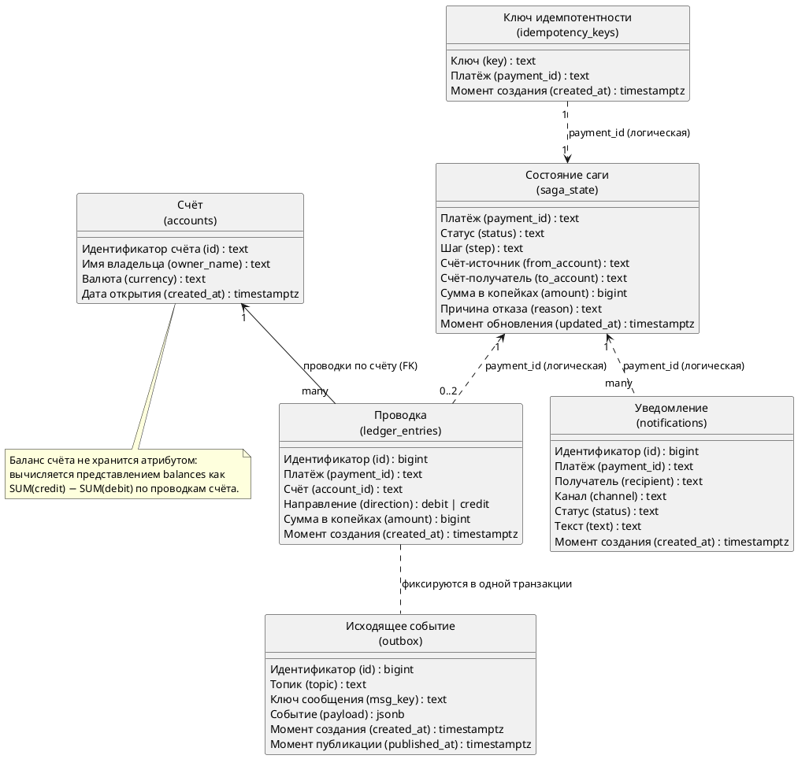

# Описание логической модели – FinTrack v2

## История изменений

| Версия | Дата | Автор | Задача | Описание изменения |
|--------|------|-------|--------|--------------------|
| 1.0 | 05.07.2026 | @hewjesten | – | Сформирована начальная версия документа |

## Логическая модель данных

Физическая реализация – [`db/001_init.sql`](../../db/001_init.sql), нотация
«воронья лапка» – в [ER-диаграмме](../erd/erd.puml). Ниже – логический уровень
в виде диаграммы классов UML.

Особенность модели: единственный физический внешний ключ –
`ledger_entries.account_id → accounts.id`. Остальные связи – **логические**,
по сквозному ключу саги `payment_id`: каждый сервис владеет своими таблицами,
и межсервисные FK намеренно не заводятся (изоляция данных по сервисам).

## Описание сущностей

### Счёт (accounts)

Счёт клиента – то, между чем ходят деньги. Владелец таблицы – сервис `ledger`.

| Атрибут | Описание | Тип | Обязательность | Значение по умолчанию |
|---------|----------|-----|----------------|----------------------|
| id | Идентификатор счёта (например, `acc_ivan`); первичный ключ | text | да | |
| owner_name | Имя владельца счёта | text | да | |
| currency | Валюта счёта (ISO-4217) | text | да | `RUB` |
| created_at | Момент открытия счёта | timestamptz | да | `now()` |

### Проводка (ledger_entries)

Журнал двойной записи: каждый успешный перевод порождает ровно две проводки –
`debit` со счёта-источника и `credit` на счёт-получатель, обе в одной транзакции
БД. Владелец – сервис `ledger`.

| Атрибут | Описание | Тип | Обязательность | Значение по умолчанию |
|---------|----------|-----|----------------|----------------------|
| id | Суррогатный первичный ключ | bigserial | да | автоинкремент |
| payment_id | Платёж, породивший проводку (сквозной ключ саги) | text | да | |
| account_id | Счёт проводки; внешний ключ на `accounts.id` | text | да | |
| direction | Направление: `debit` (списание) или `credit` (зачисление); CHECK-ограничение | text | да | |
| amount | Сумма в минорных единицах (копейки); CHECK `amount > 0` | bigint | да | |
| created_at | Момент создания проводки | timestamptz | да | `now()` |

Ограничение `UNIQUE (payment_id, account_id, direction)` – идемпотентность
уровня данных: повторная обработка того же события не задваивает проводки.

### Ключ идемпотентности (idempotency_keys)

Маппинг клиентского `Idempotency-Key` на созданный платёж. Владелец – `gateway`.

| Атрибут | Описание | Тип | Обязательность | Значение по умолчанию |
|---------|----------|-----|----------------|----------------------|
| key | Значение заголовка `Idempotency-Key`; первичный ключ | text | да | |
| payment_id | Платёж, созданный по этому ключу | text | да | |
| created_at | Момент первого запроса с этим ключом | timestamptz | да | `now()` |

### Состояние саги (saga_state)

Материализованное состояние распределённой транзакции по каждому платежу;
источник данных для `GET /transfers/{payment_id}`. Владелец – `orchestrator`
(стартовую запись создаёт `gateway`).

| Атрибут | Описание | Тип | Обязательность | Значение по умолчанию |
|---------|----------|-----|----------------|----------------------|
| payment_id | Идентификатор платежа; первичный ключ | text | да | |
| status | Статус саги: `INITIATED` → `ANTIFRAUD_PENDING` → `LEDGER_PENDING` → `COMPLETED` \| `FAILED` | text | да | |
| step | Последний зафиксированный шаг саги | text | нет | |
| from_account | Счёт-источник | text | нет | |
| to_account | Счёт-получатель | text | нет | |
| amount | Сумма в минорных единицах (копейки) | bigint | нет | |
| reason | Причина отказа (для `FAILED`): `amount_limit`, `velocity`, `insufficient_funds` и др. | text | нет | |
| updated_at | Момент последнего перехода саги | timestamptz | да | `now()` |

### Уведомление (notifications)

Журнал «отправленных» уведомлений об исходе перевода. Владелец – `notification`.

| Атрибут | Описание | Тип | Обязательность | Значение по умолчанию |
|---------|----------|-----|----------------|----------------------|
| id | Суррогатный первичный ключ | bigserial | да | автоинкремент |
| payment_id | Платёж, к которому относится уведомление | text | да | |
| recipient | Получатель (имя владельца счёта либо id счёта) | text | нет | |
| channel | Канал доставки (`push`, `sms`, `email`) | text | нет | |
| status | Итог перевода в уведомлении: `completed` \| `failed` | text | нет | |
| text | Текст уведомления | text | нет | |
| created_at | Момент записи | timestamptz | да | `now()` |

### Исходящее событие (outbox)

Transactional outbox леджера: событие-результат проводки фиксируется в одной
транзакции с самими проводками, отдельный relay публикует его в Kafka.
Владелец – `ledger`.

| Атрибут | Описание | Тип | Обязательность | Значение по умолчанию |
|---------|----------|-----|----------------|----------------------|
| id | Суррогатный первичный ключ; порядок публикации | bigserial | да | автоинкремент |
| topic | Топик Kafka, куда публикуется событие | text | да | |
| msg_key | Ключ сообщения (партиционирование; `from_account`) | text | нет | |
| payload | Событие целиком (конверт `EventEnvelope`) | jsonb | да | |
| created_at | Момент записи события | timestamptz | да | `now()` |
| published_at | Момент публикации в Kafka; `NULL` – ещё не опубликовано | timestamptz | нет | `NULL` |

Частичный индекс `idx_outbox_unpublished` (`WHERE published_at IS NULL`)
ускоряет выборку неопубликованных строк relay-ем.

### Баланс (представление balances)

Не таблица, а вычисляемое представление: баланс счёта в любой момент равен
`SUM(credit) − SUM(debit)` по его проводкам (`COALESCE(..., 0)` для счёта без
операций). Хранимого поля «баланс» нет – значит, нет и задачи синхронизировать
его с журналом.

| Атрибут | Описание | Тип | Обязательность | Значение по умолчанию |
|---------|----------|-----|----------------|----------------------|
| account_id | Идентификатор счёта | text | да | |
| owner_name | Имя владельца | text | да | |
| balance | Вычисленный баланс в минорных единицах (копейки) | bigint | да | `0` |
